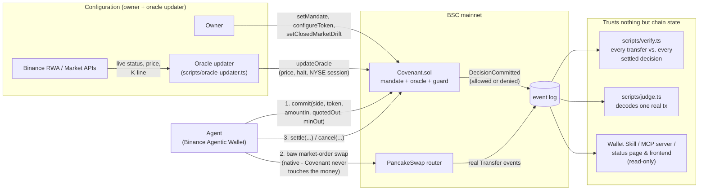

# Covenant

An on-chain mandate for an AI agent trading tokenized stocks from a Binance Agentic Wallet. The owner sets the rules: which stocks by exact address, dollars per trade, trades per day, a slippage bound, a position cap, and how far from its last NYSE close a stock may trade while the NYSE is shut. Before every trade the agent commits it to Covenant, and the contract decides on chain whether the mandate allows it. The wallet then trades natively with `baw market-order swap`, and the agent settles the real fill back on chain. `scripts/verify.ts` reconciles every real transfer in and out of the wallet against settled decisions, so a trade made without an approved decision shows up for anyone with an RPC.

Built for the BNB Hack: Tokenized Stocks Edition. Every claim on this page is backed by a real transaction, re-read from chain: on a fork of BSC mainnet against the real deployed tokens and live Binance data, and for the Agentic Wallet leg, on BSC mainnet itself (`docs/evidence/`). Covenant itself is deployed on BSC mainnet at [`0x90F642be72b5aD815B924AB3CFFd5f241Dc656aa`](https://bscscan.com/address/0x90F642be72b5aD815B924AB3CFFd5f241Dc656aa#code) (verified source); the section "Live on BSC mainnet" below lists what has actually happened on it.

**What it claims.** Binance's own wallet guardrails (daily limit, token scope, session expiry) are the hard, private limit on the wallet itself. Covenant adds a second layer that's market-aware and public: halt status, a closed-market drift rule, exact-address provider pinning, slippage checked against both the agent's quote and an oracle price, a position cap read from the wallet's real balance, and a public record of every decision, allow or deny. Covenant's decision comes before the trade, not after: **no trade can happen unseen.**

<p float="left">
  
  
  
</p>

Screenshots from a real seeded run (`scripts/seed-status-page-demo.ts`) against a local fork of BSC mainnet - real decisions, real numbers, not mockups. More on the game in "Running the status page" below.

---

## Architecture

One contract, [`contracts/Covenant.sol`](contracts/Covenant.sol), and three keys that must all differ: the **owner** sets the mandate, the **oracle updater** posts market status and price, and the **agent** (the Agentic Wallet) commits and settles. The contract rejects any overlap, so the agent can't post its own oracle.



The loop:

1. **`commit(side, token, amountIn, quotedOut, minOut, quoteRef, researchRef)`**, agent only. Covenant checks the mandate (active, not expired), the token (allowed by exact address), that no other approved decision is in flight, the oracle (fresh, not halted), the notional (buys in USDT, sells through the oracle price), the day's trade count, the slippage bound (`minOut` against both the quote and the oracle price), and for buys, the position cap. While the NYSE is closed it also applies the closed-market drift rule. It records the decision and emits `DecisionCommitted`, allowed or denied.
2. **The trade**, natively: `baw market-order swap`, through Binance's router, RFQ fills and MEV protection. Covenant never touches the money.
3. **`settle(id, swapTxHash, amountOut, executionMode)`**, agent only, with the real swap's hash and the real amount received. `cancel(id)` abandons an approved decision instead.

Worth knowing before reading the code:

- **Denials don't revert.** A reverted transaction would discard its own event, leaving no trace of the refusal. `commit` records the denial and returns, so refusals are on chain too, at gas cost only.
- **One `_evaluate`, two callers.** `previewDecision` (read-only, what the skill's `check` uses) and `commit` run the same internal function, so a preview can't drift from the real decision. Tested directly in `test/Covenant.unit.ts`.
- **Feature 3, the position cap, reads real state.** `commit` calls `balanceOf(agent)` on the stock token at decision time and denies with `PositionLimit` if the post-trade holding would exceed the owner's cap. It uses the larger of the quote and the oracle's output, so an understated quote can't slip past it.
- **Feature 1, the closed-market drift rule, answers this hackathon's opening problem.** The organizers' pitch: a tokenized stock "trades straight through the weekend, priced off a reference that has not updated in two days". While the NYSE's regular session is closed, `commit` denies a buy priced more than the owner's bound above the token's price at the last NYSE close, or a sell that far below it (`ClosedMarketDrift`). Binance's status endpoint can't say when the NYSE is shut (for bStocks it reports `TRADING` around the clock, friction-log C18), so the oracle takes the session from a NYSE calendar built from nyse.com's own holiday and early-close table, and the last-close price from the token's hourly candle ending exactly at that close. On 2026-09-25 at 07:21 UTC, with the NYSE shut, NVDAB was 0.84% above Thursday's close; the chaos-fork run below refuses a buy at that premium.
- **Provider pinning, not ticker resolution.** The allowlist is exact addresses. A ticker exists under several providers (NVDAB vs Ondo's NVDAon), and impersonator tokens exist, so resolution happens off chain in the skill, which refuses to guess.
- **Feature 2, the plain-English mandate compiler, redesigned around a real constraint.** The owner writes a sentence like *"Only AI-chip stocks, at most $1 per trade, 3 trades a day, no weekend premium over 1%"*; `compile-mandate` in the skill's CLI resolves the theme against [`skills/covenant-mandate/scripts/theme-map.json`](skills/covenant-mandate/scripts/theme-map.json) - a small, self-maintained ticker→theme map of real bStock addresses - and produces one `setMandateForTokens` transaction that configures the mandate and every token in the theme at once. This is a redesign, not the original pitch: the RWA API's advertised sector filter (Magnificent 7 / AI Chips / ETF / Buffett Portfolio) doesn't exist server-side (friction-log A10, 13+ real signed calls with every plausible parameter value returning the same unfiltered 488-token list). `Covenant.sol` gained `setMandateForTokens` for this - a genuine batch setter, not a loop of separate transactions dressed up as one - so "one owner transaction sets the whole mandate" is literally true even when the theme spans eight tokens.

Around the contract:

- [`skills/covenant-mandate/`](skills/covenant-mandate/): a Binance Wallet Skill (zero-dependency `scripts/cli.mjs`, Node 22 or later) that resolves tickers, checks a trade's decision before spending gas, and builds the commit, settle and cancel calldata that `baw contract-call` carries. Its `SKILL.md` and `references/loop.md` describe the loop as observed live on mainnet.
- [`status-page/index.html`](status-page/index.html): one static file, no backend. Reads the mandate and every decision straight from any RPC.
- [`mcp-server/index.ts`](mcp-server/index.ts): the skill's reads as MCP tools (`resolve_ticker`, `survey_providers`, `get_mandate_status`, `check_halt`, `preview_trade`), so any MCP-capable agent can query the mandate.
- [`scripts/oracle-updater.ts`](scripts/oracle-updater.ts): posts live market status (RWA asset-market-status endpoint), price (RWA dynamic endpoint), whether the NYSE session is open ([`scripts/lib/nyse-calendar.ts`](scripts/lib/nyse-calendar.ts)), and the last-close price (market K-line endpoint). If any read fails it posts nothing, the oracle goes stale, and every commit is denied.

The skill's `resolve` refuses to guess on an ambiguous ticker; `survey` reports all three providers (ondo, xstock, bstock) at once, each labeled `not-listed-on-bsc`, `dead` or `live`. "Dead" comes from real on-chain `Transfer` activity, not Binance's reported `volume24h`, which was found to be unreliable (see "Tests, and what they caught").

---

## Explored, measured, removed: `guardedSwap` and the oracle bond

Covenant v1 was a swap router: `guardedSwap` pulled USDT from the caller, checked the mandate, and swapped on PancakeSwap. A red-team review (`docs/research/opus-2026-09-24/a-redteam.md`) found it was opt-in: the same wallet could call `baw market-order swap` and skip it, and with no guarded sell, even the demo would have had to go around it. It also skipped Binance's aggregator, RFQ fills and MEV protection, and made Covenant the execution layer instead of the wallet. v2 moves execution back to the wallet and makes Covenant the decision record.

Phase 2.5 added a slashable bond for the oracle updater. As built it provided no security: the owner was the updater by default, `updateOracle` didn't require a bond, and the bond could be withdrawn in the same block as a false update. It's out of v2. Both designs remain in git history (`0a13c0b` and earlier), with the spec in `docs/research/slashable-guard-spec.md`.

---

## Red-team holes closed after the v2 rebuild

`docs/research/opus-2026-09-24/a-redteam.md` red-teamed v1. Four findings against v2's design were still open after the rebuild; all four are now fixed, each with a real fork test, not just a code change:

- **H7 (midnight double-burst, no cumulative cap).** The only notional check was per trade, so real daily exposure was `maxNotionalPerTradeUsd x maxTradesPerDay`, doubled by trading across a UTC midnight boundary. `setMaxDailyNotionalUsd` (a separate owner setter, independent of `setMandate` so tightening it never requires re-setting the mandate) now caps cumulative same-day notional; `DailyNotionalExceeded` is a new denial reason. Kept honest: a cap keyed by the UTC calendar day doesn't by itself close the midnight-boundary gap it was added for, and `test/Covenant.unit.ts` has a test that deliberately demonstrates the residual gap still clearing the cap twice within under a minute, rather than claiming the cap fixes something it doesn't.
- **H8 (no scheduled oracle updater).** `oracle-updater.ts` was a one-shot script with nothing to run it. `scripts/oracle-updater-cron.sh` (same self-disabling pattern as the off-hours cron; it removes its own crontab line on Oct 24, after judging, so judges don't find a contract that denies every commit) now exists to run it on a schedule. Not installed automatically - it's the one part of this project that would spend real gas on a timer rather than per deliberate action, so it's opt-in via `crontab -e`, documented in the script itself.
- **H10 (the authenticated Web3 API sits unused).** Every price/status read went through Binance's public, unauthenticated `bapi` endpoints; the HMAC-signed Web3 API key from Phase 0 backed nothing. `scripts/lib/web3-api-client.ts` implements the documented HMAC-SHA256 signing (`authentication.md`, verified live while investigating friction-log A10/A11) and `oracle-updater.ts`'s `readLiveOracle` now cross-checks the token address against Binance's authenticated Market API before trusting a price for it - fail-closed, same as the rest of that function, if the credentials or the listing are missing.
- **H11 (a decision wasn't provable without replaying history).** `DecisionCommitted` used to carry only the trade and the denial reason; proving a decision was evaluated correctly meant replaying `MandateSet`/`OracleUpdated` history to reconstruct what was in force. The event now also carries the mandate's per-trade cap, trade-count cap and expiry, plus the oracle's `updatedAt`, all snapshotted at commit time - a third party can check one event, no replay required.

---

## Deploying

`npm run deploy` builds with the production profile (optimizer on) and then runs `scripts/deploy.ts`. The default profile the tests use leaves the optimizer off and produces about 17 KB of runtime bytecode against about 7 KB, so it costs more gas to deploy and wouldn't match a BscScan verification done with the production settings. `deploy.ts` deploys whatever was built last, so it refuses an artifact that looks unoptimized unless `ALLOW_UNOPTIMIZED_DEPLOY=1`. It prints the deployment block; `verify.ts` and the status page both want it. The EVM version is pinned to Cancun in `hardhat.config.ts`.

---

## Live on BSC mainnet

Covenant is at [`0x90F642be72b5aD815B924AB3CFFd5f241Dc656aa`](https://bscscan.com/address/0x90F642be72b5aD815B924AB3CFFd5f241Dc656aa#code), deployed on 2026-09-30 in block 124,928,073 (tx `0x7c4e1337973dfa0b4b1547eafb94c102d852455a2603527d3b7e0cb84daa0b56`, 1.76M gas at 0.05 gwei). The source is verified on BscScan and on Sourcify with an exact match. Owner, oracle updater and Agentic Wallet are three different addresses, as the constructor requires.

The mandate is sized to the money I had: NVDAB only, $0.25 per trade, 5 trades a day, $0.75 a day, a $0.60 position cap, 1% slippage, 1% closed-market drift. The ERC-8004 identity (agent #358509) now points at the contract (tx `0x8cc455b9d02d66a4fb4e2f631e3ce79b19aaf5622f6b373e180ee934069134dc`). Everything below is in `docs/evidence/mainnet-decisions.json` and can be re-checked with `npm run verify`.

| # | What the agent tried | What happened | tx |
|---|---|---|---|
| 1 | Sell 0.001 NVDAB | Allowed and swapped, then wrongly cancelled by my own driver (see below) | commit `0x68174495…074c`, swap `0x1df46d49…e1be` |
| 2 | Buy $0.20 of NVDAB | Allowed, swapped, settled | swap `0x43d624bc…be38` |
| 3 | Buy $0.40 | Denied on chain, `NotionalExceeded` | `0x09839649…0539` |
| 4 | Buy $0.10 with a minimum output 5% under the quote | Denied on chain, `SlippageTooLoose` | `0x315a6f98…0c76` |
| 5 | Sell 0.001 NVDAB | Allowed, swapped, settled | swap `0x166d33a1…5bed` |

That is five decisions, not the thirty I planned. A buy cycle cost the Agentic Wallet 0.00029 BNB in gas, a sell cycle 0.00046 BNB and a denial about 0.00006 BNB, three to four times what I had costed from measured contract gas, and the whole budget was $2. I stopped when the wallet could no longer pay for another cycle.

`verify.ts` on this history reports two trades matched to settled decisions and one violation. The violation is real and I left it in. My first driver looked up the swap by the `orderId` that `market-order swap` returns, but `market-order list` never found that id (the listed order's id is one higher), so the driver assumed the swap had not happened and cancelled decision #1. The swap had filled. A cancelled decision can't be settled, so that sell is an `UNMATCHED_TRADE` for good. The ledger did what it is for: it caught a trade with no approved decision, and the trade was mine. The driver (`scripts/live-trade.ts`) now finds the order by token pair and start time and never cancels on its own.

The deploy also failed once. `scripts/deploy.ts` crashed right after the deploy transaction mined because a free RPC answered a receipt lookup for the new transaction with a 403 "archive request", not with null. The four configuration transactions never ran. I found the transaction, added a `RESUME_ADDRESS`/`RESUME_TX` option to finish the configuration, and made receipt polling skip an endpoint that errors. The same 403 hit the oracle updater's first run, and the default fallback provider also let 48Club's 1 gwei gas quote set the price (the other endpoints say 0.05), which would have drained the oracle updater's wallet. `bscProvider` now takes the lowest quote. Both fixes have unit tests (`test/bsc-provider.unit.ts`).

---

## Judge-runnable verification

A judge doesn't have this project's Agentic Wallet, developer mode or bStock jurisdiction clearance, so they can't reproduce a trade. They don't need to. Two scripts check this project's claims against chain state and trust nothing else.

**`scripts/judge.ts`** takes a list of transaction hashes, re-fetches each real receipt, and decodes Covenant's own event in it: the decision id, side, token, allowed or denied, the exact reason, and for a settle, the swap hash, amount and execution mode.

```bash
COVENANT_ADDRESS=0x... npm run judge
```

It reads hashes from `JUDGE_TX_HASHES` (comma-separated) or [`data/judge-tx-hashes.json`](data/judge-tx-hashes.json), and tries `BSC_RPC_URL` first, then a list of public BSC RPCs, so a judge isn't depending on one free endpoint being up.

**`scripts/verify.ts`** checks the stronger claim, that no trade happened unseen. It reads every stock-token and USDT transfer in and out of the agent's wallet since Covenant's deployment and matches each trade to the settle that claims it.

```bash
COVENANT_ADDRESS=0x... VERIFY_FROM_BLOCK=<deployment block> npm run verify
```

By default it then repeats the scan on a second RPC, pinned to the same last block, and reports `RPC_DISAGREEMENT` if the two reports differ: one endpoint silently dropping logs would otherwise hide an unmatched trade. If no other RPC can complete the scan (free endpoints cap ranges and refuse old blocks), it says so as a `CROSS_CHECK_UNAVAILABLE` notice instead of passing quietly. `VERIFY_CROSS_CHECK=0` skips the second scan, which doubles the run time. A log an RPC returns twice counts once.

It flags a trade with no settled decision (`UNMATCHED_TRADE`), a settle pointing at a transaction that moved no stock (`FALSE_SETTLE`), a settled amount that isn't what really arrived (`AMOUNT_MISMATCH`), a fill below the committed minimum (`BELOW_MINIMUM`), a trade before its commit or after its expiry, a wrong token or side, two decisions claiming one trade, and quote-token spend that brings back a token the owner never configured (`UNTRACKED_SWAP`). Two things are listed as notices, not violations: a stock sent to the wallet by a stranger who paid nothing (`INBOUND_TRANSFER`, so nobody can turn the reconciliation red by dusting the address, even with a bit of USDT bundled in), and the quote token leaving the wallet in a transaction that moved no stock (`QUOTE_OUTFLOW`, which can be a legitimate payment but is also the first thing a stolen key does). Amounts are compared against the ERC-20 transfers, not Binance's reported fill, which is in share units for bStocks (friction-log C17).

`test/verify.live.ts` proves each verdict with real swaps against live PancakeSwap liquidity on a mainnet fork: an honest buy and an honest sell reconcile clean, and a bypass, a false settle, a settle using Binance's share-unit number, and a swap after expiry are each flagged, with nothing else flagged.

---

## Chaos-fork demo

`scripts/chaos-fork.ts` (`npm run chaos-fork`) forks BSC mainnet, deploys Covenant with the real deploy script, posts the live NVDAB price, and then tries to break the mandate. Each result is re-read from the transaction's receipt by `judge.ts`, not printed from the script's memory.

```bash
npm run chaos-fork
```

A real run from 2026-09-25, with a mandate of NVDAB only, $2 per trade, a $3 position cap and 1% slippage, at a live price of $225.58. The NYSE was closed and NVDAB was 0.84% above Thursday's close, so the drift bound was set to 0.42%. These hashes exist on that local fork, not on BscScan. The real mainnet decisions are in "Live on BSC mainnet".

| Attempt | tx hash | block | Result |
|---|---|---|---|
| Impersonator token | `0xbf7f850f8bb02c0d6db0f35152350f6aa310a5c341d6bb8abe213a9d3fbc566f` | 123909274 | denied, `TokenNotAllowed` |
| $50, over the $2 cap | `0xc431d7e97b926c5a5f73b4d10a30b2ca4ab3b6386e7c0e92605046badf53f87a` | 123909275 | denied, `NotionalExceeded` |
| Quote understated 10x to hide a loose minimum | `0x5b08a06aad533cde92e4a6a13644cbaad814fbd5db1da17036d539a39fb7a106` | 123909276 | denied, `SlippageTooLoose` |
| Trade while the oracle reports a halt | `0x6f35371e4db1f362160ff083f908b0c59a17e42fa359601a98608e39bab6a8e5` | 123909278 | denied, `OracleHalted` |
| Buy at the real overnight premium, NYSE closed | `0xf78a3a30914b4f031f22c9cd83ac140729acd54c479b8b3ea4602388bbf57ae0` | 123909282 | denied, `ClosedMarketDrift` |
| $2 more with ~$1.69 already held, over the $3 cap | `0x02180dd72a751084d9b63684d9ed7ee45bbb607d5cfd8a9078ced019c6a6b63c` | 123909286 | denied, `PositionLimit` |
| A stranger commits under the owner's mandate | none | none | reverted, `NotAgent` |
| $1, within every limit | `0x704c9875cee397b7e3b26334500b90be75b26428eaa5137241d7a285d69d125f` | 123909287 | allowed |

`test/chaos-fork.live.ts` runs this exact command as a subprocess and asserts on its real output.

---

## Try-to-break-it live demo

`scripts/try-to-break-it-demo.ts` (`npm run try-to-break-it`) is the "no trade happens unseen" claim, narrated: one honest commit → swap → settle for contrast, then a real swap with **no commit at all** - exactly what a compromised or careless agent would do - followed by `verify.ts`'s real `reconcile()` catching it live. Pure framing over already fork-tested plumbing (`setupCovenant`, `reconcile`), not new mechanism, so the same script is meant to run unchanged against the real mainnet deploy once that happens.

```bash
npm run try-to-break-it
```

`test/try-to-break-it-demo.live.ts` runs this exact command as a subprocess and asserts on its real output, the same pattern as the chaos-fork test above.

---

## Off-hours logging

`scripts/off-hours-logger.ts` polls real NVDA across all three providers (halt/market status, on-chain price, and reference price where one exists) and appends one real JSON line to [`data/off-hours-log.jsonl`](data/off-hours-log.jsonl). Run it once:

```bash
npx tsx scripts/off-hours-logger.ts
```

Or continuously, via cron (self-disabling - see `scripts/off-hours-cron.sh`'s own comments; it removes its own crontab entry once past the submission deadline, no manual cleanup needed):

```bash
crontab -e
# */15 * * * * /path/to/covenant/scripts/off-hours-cron.sh >> /path/to/covenant/data/off-hours-cron.log 2>&1
```

On macOS, `cron` needs Full Disk Access (System Settings → Privacy & Security) to reliably access files outside a few default locations - if the log file isn't growing, check that first before assuming the script is broken.

**Gaps in the data are expected and real, not a bug.** Confirmed live: the very first scheduled fire (11:01) succeeded, but the next one (11:15) was silently skipped because the Mac itself was asleep at that moment (`pmset -g log` showed a wake event at 11:20:41 - cron can't fire while the whole machine is suspended). On a laptop, any stretch where the lid was closed or it idle-slept shows up as a missing entry rather than a steady 15-minute cadence. Left as-is deliberately rather than forcing `caffeinate`/`pmset disablesleep` - the gaps are themselves honest data about running unattended infrastructure on a laptop, not something to paper over.

---

## Running the tests

```bash
npm install
npx hardhat test
```

Twenty-four suites in `test/` (274 tests, one full `npm test` run, all passing), plus two in `frontend/` (39 tests, `cd frontend && npm test`). Several suites run live against a fork or Binance's real endpoints; a hosted CI runner can be geo-blocked from Binance's API, in which case those tests skip rather than fail. Also checked in CI: `npm run typecheck` (types for the scripts, tests and MCP server) and the frontend's lint and build.

The suites that deploy the contract, use a fork, or call live endpoints:

- `test/Covenant.unit.ts` (62): in-memory chain with a mock ERC20. Every denial reason, including Feature 1's drift rule (with the real NVDAB numbers from 2026-09-25) and the red-team H7 daily-notional cap (with a test that deliberately demonstrates its disclosed midnight-boundary limitation rather than hiding it), the three-distinct-roles rule, agent-only commit/settle/cancel (a stranger, the owner and the updater all revert), the settle and cancel lifecycle, the understated-quote attack, Feature 3's position cap, red-team H11's self-describing `DecisionCommitted` event, Feature 2's `setMandateForTokens` batch setter, preview/commit agreement, and H14/H15/H16's fixes (agent-scoped settle/cancel, absurd-amount denials, and the drift-at-worst-price rewrite).
- `test/Covenant.fork.ts` (7): a real fork of BSC mainnet with the real Agentic Wallet impersonated as the agent, so the position cap reads the NVDAB it really bought on Day 1. Includes a full commit, real swap and settle loop against live PancakeSwap liquidity.
- `test/nyse-calendar.ts` (12): the NYSE calendar against real dates, including a holiday, an early close, both daylight-saving switches, and a year with no data (it refuses).
- `test/oracle-updater.live.ts` (4): Binance's real status, price and K-line endpoints, posted on chain by the real updater code and read back; the last close is re-derived independently from a separate K-line fetch.
- `test/skill-cli.live.ts` (17): the skill's own commands against a spawned fork node, including its commit, settle and cancel calldata sent as real transactions, Feature 2's `compile-mandate` turning a real plain-English sentence into one real transaction that configures eight real tokens, and `classify-execution-mode` against the real Day-1 router address.
- `test/status-page.live.ts` (4): the page's event reading, joined per decision, and the fork-boundary timeout. Runs its boundary test last on purpose (see below).
- `test/mcp-server.live.ts` (9): the MCP server as a real subprocess, driven by the real MCP client.
- `test/off-hours-logger.live.ts` (2): the cron logger against Binance's live endpoints.
- `test/judge.live.ts` (8): `judge.ts` against real commits, settles and cancels, decoded field by field against ethers' own parsing, plus a never-mined hash, a wrong contract, and a dead RPC ahead of a working one.
- `test/chaos-fork.live.ts` (1): `npm run chaos-fork` itself, as a subprocess.
- `test/verify.live.ts` (2): `verify.ts` against real swaps, clean and with every kind of violation.
- `test/try-to-break-it-demo.live.ts` (1): `npm run try-to-break-it` itself, as a subprocess: an honest trade stays clean and a swap with no commit is caught.
- `test/generate-narration.ts` (4): the play-by-play prompts are built only from real decision fields (no network; the Gemini call itself is not tested).

The live suites share `scripts/lib/local-fork.ts`, which deploys with the real `scripts/deploy.ts` and posts the oracle with the real `scripts/oracle-updater.ts`, so every one of them also exercises the path the mainnet deployment will run. They're slower than a typical Hardhat suite; see below for why.

Eleven more suites are pure-function or mock-RPC coverage, with no fork, no network and no contract deployment: fast checks of logic the suites above only exercise on the happy path, or don't touch:

- `test/verify.unit.ts` (51): `reconcile()` against a mock JSON-RPC server with crafted logs - H13's overspend repro (a $1-approved buy that really moved $10,000), H14's agent-rotation scoping, a multi-token trade, a revoke, a token disallowed mid-approval, a missed deployment block, `getLogs` chunk boundaries, a stock dusted into the wallet by a stranger (with and without USDT bundled in), a quote-token spend on an unconfigured stock, USDT leaving the wallet with nothing coming back, and one scan per direction however many tokens are configured. Every violation kind has its own crafted case, a log listed twice counts once, a second RPC that disagrees is reported, one that is down is noted, 200 random honest histories must reconcile clean, and one corrupted trade among honest ones must be flagged as exactly the expected kind on exactly that trade. Every boundary (a fill exactly at the minimum, a swap in the decision's last second, a wallet's last second in scope) is tested on both sides. The live suite only ever reconciles one honest trade at a time; this is where the actual violation-detection logic gets tested against something trying to slip past it.
- `test/skill-cli.unit.ts` (17): the Wallet Skill CLI's own input validation. `resolve` refuses ambiguous chains, the calldata builders refuse a negative amount, a `2^256` amount, a JS number that already lost precision, and a ticker where an address belongs, `compile-mandate` refuses two themes or a bound over 100%, and a stalled response body times out.
- `test/erc8004-update.unit.ts` (3): the identity-update script's document builder, which adds the deployed contract and the agent's own id without duplicating on a re-run.
- `test/bsc-provider.unit.ts` (5): the default RPC provider takes the lowest gas quote (48Club says 1 gwei, the rest 0.05) and skips an endpoint that errors on a receipt lookup instead of crashing, both found on the first mainnet deploy.
- `test/oracle-guards.unit.ts` (13): the price-versus-candle sanity check and the multi-token oracle spec (`theme:<key>` or a comma list), no network.
- `test/drift.unit.ts` (6): every copy of a contract fact matches the compiled contract: the CLI's selectors, the event topics in `judge.ts` and `verify.ts`, and the `DenialReason` list in the contract, the CLI, the status page and the game's monster, attack and explanation tables.
- `test/skill-cli-logic.unit.ts` (15): the skill CLI's plain-English mandate compiler (defaults, regexes, rounding, the 100% bounds), `resolve`'s chain and provider disambiguation and `survey`'s dead, live and unknown verdicts against a stubbed network, the bytes32 and address refusals, the router table and the execution-mode enum.
- `test/cli-encoding.fuzz.unit.ts` (3): the CLI's hand-rolled ABI encoder against ethers on random inputs (every amount from 0 to 2^256-1 as a bigint, a decimal string or a number; arrays of every length), the input refusals, and `judge.ts`'s event decoder against ethers-encoded logs.
- `test/web3-api-clock.unit.ts` (6): the signed Web3 API client when this machine's clock is outside Binance's receive window: it corrects once from the server's own time and retries, then gives up rather than looping, and doesn't retry any other error.
- `test/Covenant.fuzz.unit.ts` (1): a seeded differential fuzz of `previewDecision` against an independent BigInt model of the rules, over amounts up to the `2^128` limit; it asserts there is never a revert (a panic instead of a denial) and never a disagreement, and that it reaches the late checks. 12,000 cases at development time found no mismatch.
- `test/status-page-lib.unit.ts` (21): the sell-side wording in `describeDecision`/`guardedVsUnguarded` (the live suite only ever commits buy-side decisions), and `resolveFromBlock`'s input validation (NaN, negative, non-integer).

### What needs a secret, and what needs an archive RPC

Not every test or script here runs the same way. Some need nothing but a public RPC; some need a real API key; a few need an RPC that actually serves old blocks, which most free public BSC endpoints refuse past a shallow window.

| Needs | Examples | Why |
|---|---|---|
| Nothing (public RPC only) | `test/Covenant.unit.ts`, `test/verify.unit.ts`, `test/skill-cli.unit.ts`, `test/status-page-lib.unit.ts`, `test/oracle-guards.unit.ts`, `test/erc8004-update.unit.ts`, `test/drift.unit.ts`, `test/nyse-calendar.ts` | Pure logic, or a mock chain/RPC - no real network call. |
| `WEB3_API_KEY` / `WEB3_API_SECRET` | `test/oracle-updater.live.ts`, `test/skill-cli.live.ts`, `scripts/oracle-updater.ts` | Reads Binance's RWA Data/Market APIs (real price, real market status). |
| `GEMINI_API_KEY` | `scripts/generate-narration.ts` | Batch play-by-play narration - see "Running the status page" below. |
| An RPC that serves `eth_getLogs` at depth (bloXroute's `bsc.rpc.blxrbdn.com` and 48Club's `rpc-bsc.48.club`; both are in the defaults) | `scripts/verify.ts` over any window longer than about an hour, the frontend's snapshot/re-verification mode | Probed on 2026-09-29 with one filter (a wallet's transfers of two tokens): bloXroute answered 5,000-block ranges back at least 3 million blocks (about 16 days) and 48Club back at least 1 million, both refusing 10,000-block ranges. The rest answer `eth_call` and receipts but not logs: `publicnode` serves logs only for the last ~10,000 blocks, and the Binance dataseeds refuse `eth_getLogs` entirely ("limit exceeded", even for 100 blocks). `1rpc` disables it. So without the first two, `verify.ts` could scan nothing older than about an hour. The scan asks four ranges at once and remembers which endpoint answered. `status-page/lib.mjs`'s `fetchDecisionEvents` chunks its own calls the same way. |
| A forked local node (`hardhat node --fork`) | Every `*.live.ts` and `*.fork.ts` suite, `scripts/chaos-fork.ts`, `scripts/try-to-break-it-demo.ts` | Real on-chain state (the live bStocks contracts, real liquidity) with no risk to the $2 real-mainnet budget. |

---

## Running the status page

Two versions exist. `frontend/` (React + Vite + Tailwind + Phaser) is the primary one, built for GAMIFICATION-PLAN-2026-09-25.md's presentation layer - boss battles, the Guarded vs. Unguarded Twin, the trading card, and the territory map. `status-page/index.html` is the original zero-build static page; both read the exact same tested logic in `status-page/lib.mjs`, so nothing about the on-chain reads or decision decoding differs between them.

```bash
cd frontend && npm install && npm run dev
```

Open the printed localhost URL and point it at an RPC URL and a deployed Covenant (or pass `?rpc=...&contract=...&fromBlock=...`). `scripts/seed-status-page-demo.ts` deploys to a local `hardhat node --fork` and records a denial, a settled trade and a cancelled one, if you want something to look at - works against either version, since both take the same query params.

`cd frontend && npm run build` produces a static site in `frontend/dist/`. Its asset paths are relative, so it works at a site root or under a sub-path such as GitHub Pages' `/<repo>/`. The page shows only what its RPC returns, and says which RPC host and chain that was; to check a deployment independently, run `verify.ts`.

`frontend`'s tests (`cd frontend && npm test`, Vitest, Node 22+) cover the game's logic rather than its pixels: the town layout, the road routing, and the battle script for every real `DenialReason`. The rendering itself was checked by playing it in a browser.

### The game

The status page as a small Pokemon-style town, built so a kid could follow what the agent did today. It uses Phaser 3 and Kenney's CC0 "Tiny Town" and "Tiny Dungeon" packs; the license files are in `frontend/public/game/`. See the screenshots at the top of this page - from a real seeded run (`scripts/seed-status-page-demo.ts`) against a local fork, not mockups.

- **Each house is a shop for one real token.** Houses are assigned by real GeckoTerminal pool reserves (`frontend/src/data/liquidity.ts`, from `docs/research/verified-facts.md` and friction log B8/B9), so the biggest house really is the busiest market. bStocks Town is full of shops. Ondo Village has one small one. The two xStocks shops are ruins marked CLOSED ($324 and $2 in their pools, $0 a day traded).
- **The agent walks the roads.** Press start and every real decision replays oldest first. The agent walks from home along the streets to that token's shop (`route()` in `frontend/src/game/logic.ts`; a test walks every pair of places and fails if a route leaves the road). A token with no shop in town, like the impersonator from the bypass demo, sends it to a lot marked MYSTERY.
- **Every trade is a battle.** Allowed trades are battles the agent wins against a Rule Checker knight. Denied trades are battles it loses to the monster for that rule: a Spending Cap cyclops for `NotionalExceeded`, a Weekend Gap Demon for `ClosedMarketDrift`, and so on. Each denial ends with one plain sentence taken from what `Covenant.sol`'s `_evaluate` actually checks, using the real numbers from the commit event, e.g. "Too big! The rules only allow $1 per trade." Then "TRADE BLOCKED - your money is safe."
- **The canvas renders at the screen's real pixel density** and the camera fits the town to any window shape. A forest fills the leftover space instead of black bars. When the menu is open on a wide screen, the town shifts over so the menu never covers a battle.

### Guarded vs. Unguarded Twin

Still shown in the decision list for every real denial: what the wallet would have spent with no mandate at all, computed from `amountIn` Covenant already evaluated at commit time - no second real trade, no invented number (`status-page/lib.mjs`'s `guardedVsUnguarded`).

### Trading card

A real ERC-8004 identity, registered on BSC mainnet (`docs/evidence/erc8004-registration.json`: agentId 358509, tx `0x34fbf9...591f1b`, ~$0.05 real gas, ahead of the single final mainnet deploy pass by explicit choice, since this card needed a real identity to show). The card names the contract its numbers came from, and its track record covers every decision in the scanned range, not just the newest 50 the list shows, so its tier doesn't change when old decisions scroll off. The registration was made before the contract existed, so after the mainnet deploy `scripts/update-erc8004.ts` (a dry run unless `CONFIRM=1`) sets a new agent URI that links the identity to the deployed contract. The rarity tier is a real classification from the actual track record (`frontend/src/lib/rarity.ts`) - Legendary the moment a real `ClosedMarketDrift` denial lands, Gold once a real denial and a real settle both exist, Silver for real activity short of that, Bronze otherwise. That's exactly the kind of task TypeSafe's Jev model (a classifier, not a text generator - confirmed by reading its own docs, not assumed) is built for; it's wired as a disclosed, deterministic heuristic instead of a live Jev call because a real API key needs a new third-party account this session can't create on your behalf, the same constraint as Gemini's key below.

### Play-by-play narration (needs your own key)

`scripts/generate-narration.ts` batch-generates one sportscaster-style sentence per real decision via Gemini, grounded only in real on-chain fields, and writes `frontend/src/data/narration.json` for the app to read statically (no live API call from the browser, no key exposed client-side). Needs a free `GEMINI_API_KEY` from `aistudio.google.com` - a real account sign-in, so not something this session can do for you; the app renders nothing extra until that file has real entries.

```bash
GEMINI_API_KEY=... npx tsx scripts/generate-narration.ts <rpcUrl> <covenantAddress> <fromBlock>
```

---

## Running the MCP server

```bash
npm run mcp-server
```

Speaks standard MCP over stdio. To register it with an MCP client (Claude Code, Cursor, etc.), point it at this repo:

```json
{
  "mcpServers": {
    "covenant-mandate": {
      "command": "npx",
      "args": ["tsx", "mcp-server/index.ts"],
      "cwd": "/path/to/covenant"
    }
  }
}
```

---

## Tests, and what they caught

Every functional claim on this page is backed by a real bug this project's own test suite (or a manual browser session, where noted) actually caught - not a hypothetical read of the code. The handful below with their own write-up are the ones that mattered most technically; everything else is tabulated by theme so this section stays readable as it keeps growing. Full detail on every one is in the real commit history and the test files named.

### The core sequence: real red-team fixes, each with a live repro before the fix

**A missing struct field silently broke every real swap.** `Covenant.sol`'s PancakeSwap V3 `SwapRouter` interface was written from memory of the general Uniswap-V3-style `ExactInputSingleParams` shape and compiled fine - because the unit suite's mock router shared the same wrong assumption. The fork suite caught it on the very first real swap: a revert with no reason string. PancakeSwap's real struct (confirmed against `github.com/pancakeswap/pancake-v3-contracts`) has an extra `deadline` field between `recipient` and `amountIn` - a struct missing a field still compiles, but the ABI encoding sent to the real router was garbled from `amountIn` onward. Fixed by adding `deadline` (passed as `block.timestamp`) to both the real interface and the mock, which need to stay in lockstep for the unit suite to mean anything. Exactly the kind of bug a live integration test exists to catch and a mocked-only suite structurally cannot.

**The ticker resolver silently picked the wrong chain**, one axis deeper than the bug it was written to prevent. `resolve` already guarded against a ticker existing under multiple *providers* (`DRAMon` vs `DRAMB`); live testing found a real second axis it had missed entirely - a single provider can list the same ticker on multiple *chains* at once. `{ ticker: "NVDA", provider: "ondo" }`, seemingly unambiguous, silently returned the Ethereum-mainnet address instead of BSC's, with no error. Fixed by requiring both the provider axis and the chain axis to collapse to exactly one match, with a BSC (`56`) default applied only when that alone already narrows to one - `test/skill-cli.live.ts` asserts the exact case that broke.

**H12: a zero-size sell during closed-market hours panicked instead of denying cleanly.** Found reading `_evaluate` during a pre-deploy audit - the closed-market-drift check's sell branch divides by `amountIn` with nothing upstream guaranteeing it's nonzero. Confirmed live before touching the contract: a throwaway test reverted with a real `panic code 0x12 (division by zero)`, breaking `commit()`'s own documented "never reverts on a policy denial" contract. Originally fixed by letting a zero-size trade pass the check instead of adding a new `DenialReason` - **superseded by H15 below**, which found "moves no real notional" wasn't quite true for the wider family of degenerate inputs this opened the door to, and replaced it with a real `InvalidAmount` denial.

**H13: `verify.ts` trusted `amountIn` as a spending cap without ever checking real transfers against it.** `reconcile()` joined commits to settles and to real transfers, but never compared a decision's real net spend against its own `amountIn` - a wallet could settle a decision honestly while the underlying transfer moved far more value than approved (the repro: a $1-approved buy that really spent $10,000), and it would still read clean. Caught by a purpose-built mock-RPC test (`test/verify.unit.ts`). Fixed by tracking real per-decision `quoteIn`/`quoteOut` movements and flagging `AMOUNT_IN_EXCEEDED`, with a small tolerance for legitimate price improvement. Same pass added `MULTI_TOKEN_TRADE` for a transaction moving a second configured token `verify.ts` wasn't even looking at.

**H14: `verify.ts` had no concept of the agent changing mid-flight.** After a `setAgent` rotation, a stale approval from the old agent could be matched against a transfer made under the new one, and nothing caught it. Fixed on both sides: `Covenant.sol` now records `agent` on the `Decision` struct at commit time and rejects `settle`/`cancel` from anyone else with `NotDecisionAgent`; `verify.ts` derives agent tenures from `AgentChanged` events and scopes a decision to the agent who committed it, plus one decision-TTL grace window after a handover - anything outside that is `AGENT_MISMATCH`.

*Two follow-up bugs found in this fix itself, on a second red-team pass, both with a live repro before being fixed:* (1) `settle`/`cancel` were still gated by `onlyAgent` on top of the new `d.agent` check, so once an agent rotated away, a decision it committed but hadn't settled became permanently un-settleable by *anyone* - fixed by dropping the now-redundant `onlyAgent` modifier, since `d.agent == msg.sender` is already strictly correct on its own. (2) `verify.ts`'s `inScope()` used `Array.find()` to locate a wallet's handover, which returns the *first* match, not the most recent - a wallet that held the agent role across two non-contiguous tenures got scoped against its old, irrelevant handover instead of its real one. Fixed by scanning all matches and keeping the last.

**H15: absurd amounts (zero, or near `uint256` overflow) were a live path to a panic or silent wraparound**, not just H12's one case. Fixed with `MAX_AMOUNT = type(uint128).max` and a guard at the top of `_evaluate`: any of `amountIn == 0` or `amountIn`/`quotedOut`/`minOut` over `MAX_AMOUNT` now returns `InvalidAmount` immediately. `updateOracle` got the same bound, reverting `InvalidBound` (a genuine operator error, not a policy denial). Tested against a `2^250` sell, `2^255` amounts on both sides, and a buy at exactly `MAX_AMOUNT`.

**H16: the closed-market drift guard measured drift at the quote**, not the worst price the trade could actually fill at - letting an honest quote at the bound, paired with a loose `minOut`, fill at a real worst-case price well outside it (the same "checked the wrong number" shape as red-team H5's original slippage bug). Fixed by measuring drift at `minOut` instead of `quotedOut`, the same worst-case value the slippage check already uses.

### Four rounds of hardening the same two input-validation functions

`skills/covenant-mandate/scripts/cli.mjs`'s `hex32`/`addr32` (which turn a caller's amount/address into calldata) and `status-page/lib.mjs`'s `resolveFromBlock` went through four separate red-team passes, each catching a real gap the previous one left open - the pattern each time being "a value silently means something other than what the caller's own stated convention says it should," never a crash:

| Round | What silently got through | Fix |
|---|---|---|
| 1 | `BigInt(n)`'s own raw, unformatted `SyntaxError` on garbage input (no `exitCode`), inconsistent with every other refusal | Wrapped in `try`/`catch` for a clean `Error` |
| 1 | `resolveFromBlock` used `Number.isInteger`, not `Number.isSafeInteger` - `Number.isInteger(Number("9007199254740993"))` is `true` despite already-lost precision | Switched to `isSafeInteger`, matching `hex32`/`addr32`'s own standard |
| 2 | `true`/`false` → `1`/`0`, `[]` → `0`, `[100]` → `100`: `BigInt()`/`Number()` coerce far more than "string or number," all silently building plausible-looking calldata instead of refusing | Required `typeof n === "string" \| "number"` (`resolveFromBlock` too) before either parser ever sees the value |
| 2 (regression from the row above) | The new type check broke a real internal caller: `encodeUintArray` (Feature 2's `compile-mandate`) calls `hex32` on real `bigint` values, not just external input - caught immediately by `test/skill-cli.live.ts`, not the new unit test, which had no direct `hex32` coverage at all | Allow-listed `typeof n === "bigint"` too; added a direct `hex32()` unit test so the fast suite now guards this itself |
| 3 | `BigInt()`/`Number()` both natively parse a `0x`/`0b`/`0o`-prefixed string as hex/binary/octal, not decimal - `hex32("0x10")` silently built calldata for `16`, `resolveFromBlock("0x10", ...)` silently returned block `16` | Required the string match `/^[+-]?\d+$/` (plain decimal, optional sign) before it reaches either parser |

### Everything else that broke, and what it taught

| Bug | Root cause | Fix / proof |
|---|---|---|
| Fork tests against BSC ran far slower than Hardhat's defaults assume | Hardhat 3's fork provider fetches remote state via `eth_getProof`; BSC's state trie returns meaningfully larger proofs per call than Ethereum's - a naive one-fork-per-test structure pushed total run time past Mocha's 40s-per-test default | Fork and fund once per suite instead of once per test; read transaction results off the receipt (`tx.wait()`) instead of a separate `queryFilter` call, which burns its own `eth_getLogs` request against the same rate limit (friction-log B12-B14) |
| `??` swallowed a blank `.env` value | `.env.example` ships keys present-but-blank; `??` only falls back on `null`/`undefined`, not `""` | Switched to `\|\|` across `hardhat.config.ts`, `deploy.ts`, `oracle-updater.ts` |
| `.env` was never actually being loaded | `hardhat.config.ts` never called anything like `dotenv/config` | `process.loadEnvFile()` (Node 22 built-in) |
| Two scripts silently ran against two different chains | `--network bscFork` is `edr-simulated` - every invocation spins up its own throwaway chain, discarded on exit | Added a persistent `localhost` network pointed at one long-running `hardhat node --fork` |
| `Math.max(0, someBigInt)` throws, silently | `Math.max` calls `ToNumber`, which rejects BigInt; the throw was swallowed by an RPC-failover `try/catch` and misreported as "all RPCs failed" | Compare the two BigInts directly instead of routing through `Math.max` |
| `judge.ts` importing `asBool`/`asUint` failed | Real functions in `cli.mjs`, just never added to its `export {}` line | Duplicated the two one-liners locally rather than widen `cli.mjs`'s public surface |
| A "dead" provider (ondo's `GMEon`) stopped being dead between test-write and test-rerun | The test pinned a point-in-time liveness label as a fixed fact instead of re-deriving it | Kept the stable assertions (bstock dominates, xstock stays dead), derived ondo's label from its own freshly-observed transfer count |
| `judge.ts` trusted a single RPC | Written later than `survey`'s own failover pattern, didn't reuse it - a script whose whole point is independence became a single point of failure | Generalized `jsonRpcWithFailover`/`ethCallWithFailover`; `test/judge.live.ts` lists a genuinely dead RPC ahead of a working one and asserts it still succeeds |
| `chaos-fork.ts` hit `NONCE_EXPIRED` on a real run - twice, in two files | Raw `ethers.Wallet` re-queries `getNonce("pending")` on every send, which can race the node's own mempool bookkeeping under several back-to-back sends; recurred later once Phase 2.5's fixture grew from 6 to 12 sequential sends | Switched both to `ethers.NonceManager`; the fixture's timeout was also raised 120s→180s once real per-`await` timestamps proved genuine (not hung) progress just past the old limit |
| Binance's reported fill is in share units; the chain moves token units | NVDAB's shares multiplier (1.000778) differs from `balanceOf`'s real token amount, with no field saying which is which | Settle with the real ERC-20 `Transfer` amount everywhere; `verify.ts` flags a settle using the share-unit number as `AMOUNT_MISMATCH` (friction-log C17) |
| Ethers' `getBlock("latest")` was 12 minutes stale after a fork time-jump | Ethers caches its own resolution of `"latest"` after `tx.wait()` polling | Read `eth_getBlockByNumber("latest")` directly over raw RPC for anything time-sensitive |
| An ethers `Result` loses its named keys when spread | `{ ...parsed.args }` keeps indexed entries, not names - 21 tests failed at once | `parsed.args.toObject()` |
| A slippage-floor `minOut` set exactly at the bound rounds under it | Integer division truncates | Test leaves a small margin instead of the literal bound |
| The chaos-fork demo's "legitimate" trade was denied, correctly | It funded the wallet with $3.38 against a $3 cap, then ran the contrast trade already over the cap | Demo funds $1.69 instead, so the contrast trade is a genuine allow |
| `commit()` failed to compile after H11 enriched its event | 15 emit arguments overflowed Solidity's legacy codegen stack (`Stack too deep`) | `viaIR: true` in `hardhat.config.ts` - the standard fix, no behavior change |
| A summarizer misread NYSE's holiday table; the raw page didn't | Early closes live in footnotes the summary folded into the wrong rows, inventing early closes for 5 actual full closures | Built `nyse-calendar.ts` from the raw HTML table + footnotes directly |
| The H7 midnight-burst test denied everything | Hardhat's automining timestamp only guarantees strictly increasing, not real-clock-paced, so both sides of the burst landed in the same UTC day | Gave each side real time headroom (15s / 20s) instead of the scenario's literal minimum gap |
| The try-to-break-it demo settled its own honest trade with the quote, not the real fill | Passed `quotedOut` to `settle` instead of the swap receipt's real `Transfer` amount - the exact mistake friction-log C17 documents | `verify.ts`'s own `reconcile()`, run in the same script, caught it immediately (0 matched instead of 1); fixed to read the real `Transfer` log |
| A rounding artifact at exactly the drift bound | `quotedOut = amountIn × 1e18 / price` truncates, landing ~1e-16 of the price over the bound | Errs toward refusing (the right direction for a guard) - left as-is, asserted directly in the unit test |

### Later passes: a different tool each time

After the fixes above, the code went through eleven more red-team passes. Reading alone stopped finding things quickly, so each pass used a different lens, and each finding was reproduced (or a test written that failed) before it was fixed.

| Lens | What it found | Fix |
|---|---|---|
| Reading the code again, with a repro for each finding | A buy declaring `amountIn` = $1 with a $50 quote was approved (nothing bounded the quote above the oracle) | `_evaluate` denies a quote more than the slippage bound above the oracle |
| | Buying a stock the owner never configured reconciled clean; anyone could turn the reconciliation red for good by dusting the wallet, even with a bit of USDT bundled in; a stolen key sending its USDT away was invisible | `UNTRACKED_SWAP`; `INBOUND_TRANSFER` and `QUOTE_OUTFLOW` notices |
| | A theme mandate allowed eight tokens but the oracle kept one fresh; the oracle cron stopped before judging began; runs could overlap and race on the nonce | Multi-token updater (`theme:<key>`), cron through judging, a lock |
| | The status page opened onto an empty ledger (500 blocks is minutes on BSC); `compile-mandate` silently picked one of two themes and emitted calldata that would revert; one hung RPC stalled `verify` and `judge` | 50,000-block default and the deploy block printed; refusals; timeouts everywhere |
| | The deploy could ship the unoptimized build (17 KB against 7 KB); the EVM version was pinned only for production | `npm run deploy`, a size guard, Cancun pinned in both profiles |
| | The map showed allowed trades at a sign reading "NOT ALLOWED"; a badge hid its text; a 20 Sep liquidity snapshot was shown as current | "OFF THE MAP", the badge moved, the snapshot dated |
| A type check of everything the frontend build doesn't cover | 43 errors in the scripts, tests and MCP server | JSDoc on the CLI, all fixed, `npm run typecheck` in CI |
| The coverage report | `Covenant.sol` at 97% lines | 100% of lines and statements |
| A check of every copy of a contract fact | Selectors, event topics and the `DenialReason` list are copied into five places | `test/drift.unit.ts` checks each against the compiled contract |
| Deliberate breaks of the code (mutation testing), 33 in the contract, 33 in `verify.ts`, 114 in everything else | Five `verify.ts` violation kinds could be deleted with every test green; a daily counter that counted each trade twice went unnoticed; most of `compile-mandate`, `resolve` and `survey` was exercised only by live suites | A crafted case per violation kind, exact-second and exact-wei boundary tests, and stubbed-network unit tests. Every break is now caught but one equivalent one |
| Fuzzing against an independent model | Nothing wrong: 12,000 random `previewDecision` cases matched a BigInt model with no revert; the CLI's calldata matched ethers byte for byte on 3,000 random inputs; 200 random honest histories reconcile clean through `verify.ts`, and a corrupted trade among them is flagged as exactly the right kind. The one real find was a `survey` off-by-one. | Kept as seeded tests |
| A full live run | This laptop's clock was 19 seconds behind Binance's, and the signed API rejects a timestamp outside its receive window (code 40103) | The client corrects once from the server time in the error and retries (friction log A12) |
| Checking my own pushes | Two regressions of mine: CI failed on a clean checkout (the typecheck needed compiled artifacts), and the Cancun pin covered only one profile | Fixed the same day, with a drift test |
| Provenance | A forged `?rpc=` link makes the page show made-up decisions under Covenant's name | The page and the trading card name the RPC host and chain |
| The RPC itself | A log returned twice made an honest trade look like three violations; one endpoint silently dropping logs could hide a bypass | Logs are de-duplicated by transaction and index; `verify.ts` asks a second RPC by default and reports `RPC_DISAGREEMENT` (or says it couldn't) |
| Real data instead of mocks: probing the free BSC RPCs the judge-run scan would use | `eth_getLogs` works on only two of the dozen or so I tried at any depth (the Binance dataseeds refuse it even for 100 blocks; `publicnode` only for the last ~10,000 blocks), so `npm run verify` on the old defaults could scan nothing older than about an hour, and the README claimed otherwise | Two endpoints that do serve logs at depth are now first in the defaults; the scan asks four ranges at once, remembers which endpoint answered and reads the config events out of the same pass (friction log B19) |
| The one unattended process (the oracle updater) | Its default RPC rate-limited within minutes of ordinary use, and a stuck transaction would hold the run and, through the lock, every later one | Several endpoints behind a fallback provider (a transaction is broadcast to all), and a 120-second bound on waiting for the receipt |
| A phone-sized browser | In portrait the whole town was fitted to the width: shop signs a few pixels tall, most of the screen empty forest, dialogue text about 6 px | A camera that follows the agent at a readable zoom, and a tall battle stage shaped like the screen (about 12 px text) |
| The repository | No `LICENSE` file, and `package.json` said ISC where the contracts say MIT; this section had grown to a hundred lines | MIT `LICENSE`, consistent metadata, and this table |

### The one bug only found by running it in a browser

Every bug above was caught by an automated test. This one wasn't: manually driving `status-page/index.html` against a real fork in a real browser found that a query range crossing the fork's boundary makes Hardhat's `eth_getLogs` hang forever (friction-log B16). Fixed properly, not just logged: `fetchAttestations` races the real call against a client-side timeout, and a new live suite (`test/status-page.live.ts`) proves both sides - a safe range returns real events fast, a boundary-crossing one rejects within the timeout instead of hanging. Writing that test caught two more things live: the "safe" boundary is `forkStartBlock + 1`, not `forkStartBlock` itself (still needs the same remote lookup and hangs identically), and one hung `eth_getLogs` call degrades the *whole node* for calls after it - so the suite deliberately runs its node-degrading test last, documented as such in its own comments.

---

## Scope, by design

- **Covenant is a decision record, layered on top of the wallet's own guardrails.** Binance's daily limit, token scope and session expiry are the hard, private limit on the wallet itself; Covenant adds the market-aware, public layer on top. Enforcement works by making every decision detectable, not by taking custody.
- **The oracle updater runs on a schedule you choose to start.** `scripts/oracle-updater-cron.sh` is opt-in rather than always-on, matching this project's policy of spending real gas only on deliberate action. While it's running, a fresh price posts on schedule; if it's ever stopped, the design fails closed - the oracle ages past its staleness bound and commits are denied rather than evaluated against stale data.
- **H7's daily-notional cap closes the midnight-double-burst gap for everything except a burst timed exactly across the UTC boundary.** `test/Covenant.unit.ts` has a test that demonstrates this specific residual case directly, so the boundary is measured rather than assumed.
- **Off-hours logging reflects real conditions, laptop sleep included.** `data/off-hours-log.jsonl`'s occasional gaps (confirmed live via `pmset -g log`) are what running unattended infrastructure on a laptop actually looks like, left as-is rather than papered over with `caffeinate`.
- **The trading card's rarity tier is a deterministic classification** (`frontend/src/lib/rarity.ts`) standing in for a live TypeSafe Jev call, which needs its own third-party API key.
- **Reconciliation is scoped to the configured tokens.** `verify.ts` catches an unconfigured token bought with the quote token, but a stock bought with native BNB leaves no quote-token movement to key off, so only configured tokens are reconciled in that case.
- **The closed-market drift rule is as accurate as the Binance status/price feeds it reads.** Like any oracle-based guard, it fails closed on a failed read; a read that succeeds with wrong upstream data is outside what it can catch.
- **The Agentic Wallet's developer mode lapses after ~7 days of external-transaction inactivity** (undocumented by Binance, found by testing it - friction-log C14). A fork-heavy dev workflow doesn't touch this on its own, so a deliberate trivial real transaction on a schedule keeps it alive through the build window.

---

## License

MIT, see [`LICENSE`](LICENSE). The game art is Kenney's CC0 Tiny Town and Tiny Dungeon packs.
