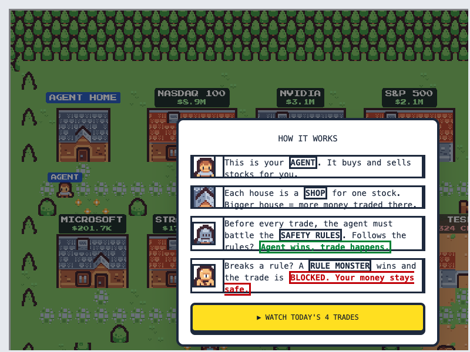
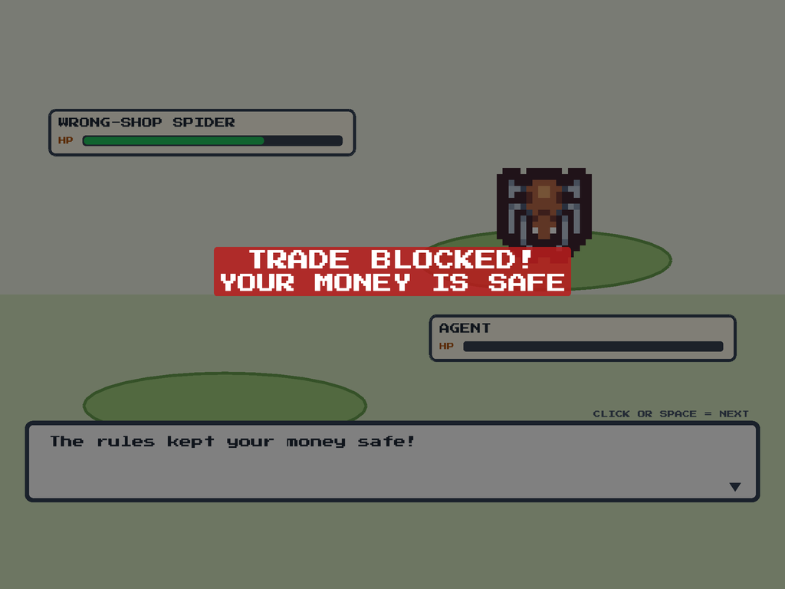
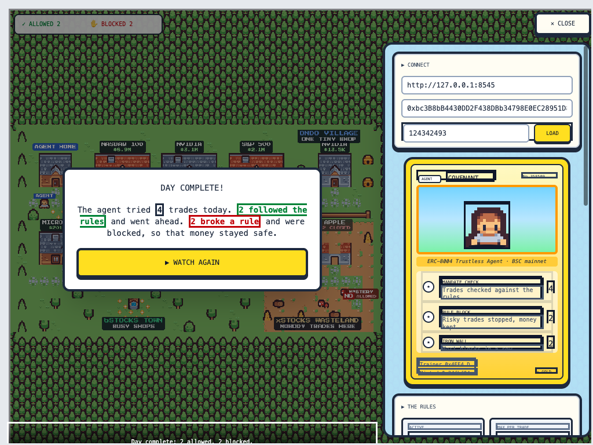
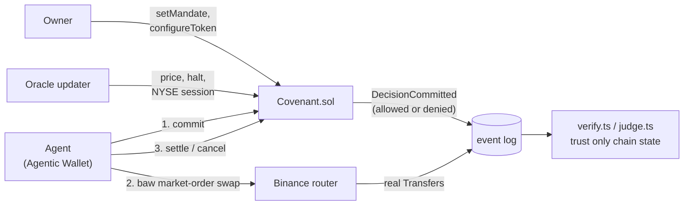
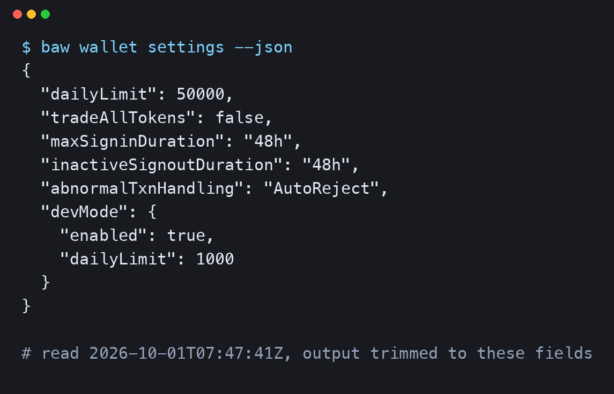

<p align="center">
  
</p>

# Covenant

**An on-chain decision ledger for an AI agent that trades tokenized stocks.**

An owner sets a mandate on BNB Smart Chain: which stocks by exact address, dollars per trade, trades and dollars per day, a slippage bound, a position cap, and how far from its last NYSE close a stock may trade while the NYSE is shut. Before every trade, the agent (a Binance Agentic Wallet) commits it to Covenant, and the contract decides on chain whether the mandate allows it. The wallet then trades natively with `baw market-order swap`, and the agent settles the real fill back on chain.

Covenant never touches the money. What it guarantees is that no trade happens unseen: `scripts/verify.ts` reconciles every real transfer in and out of the wallet against settled decisions, and a trade without an approved decision shows up for anyone with an RPC.

**Live on BSC mainnet:** [`0x90F642be72b5aD815B924AB3CFFd5f241Dc656aa`](https://bscscan.com/address/0x90F642be72b5aD815B924AB3CFFd5f241Dc656aa#code), source verified.

**Live app:** [covenant-eight-self.vercel.app](https://covenant-eight-self.vercel.app). It opens on a shipped snapshot of the mainnet ledger (free RPCs only keep a few days of logs), and the LOAD button re-reads the chain live.

Built for the BNB Hack: Tokenized Stocks Edition (16 Sep to 11 Oct 2026).

**Demo video:** [youtu.be/pzDcK0a-rHA](https://youtu.be/pzDcK0a-rHA). **Slide deck:** [`docs/covenant-deck.pptx`](docs/covenant-deck.pptx).

<p align="center">
  
  
</p>
<p align="center">
  
</p>

Screenshots from a seeded run against a local fork of BSC mainnet, not mockups.

---

## How it works



Three keys must all differ, and the constructor rejects any overlap: the owner sets the mandate, the oracle updater posts market status and price, and the agent commits and settles. The agent can't post its own oracle.

`commit` checks the mandate, the token, the oracle, the notional, the day's limits, the slippage bound and, for buys, the position cap, then records the decision and emits it, allowed or denied. **Denials don't revert**, because a reverted transaction discards its own event and leaves no trace of the refusal. `previewDecision` and `commit` run the same internal function, so what the skill checks before spending gas is what the contract decides. Each `DecisionCommitted` event also carries the mandate's caps and the oracle's timestamp as they stood at commit time, so one event proves a decision without replaying history.

| Rule | Denial | How |
|---|---|---|
| Token not on the allowlist | `TokenNotAllowed` | Exact addresses. A ticker exists under several providers and impersonators exist, so resolution happens off chain and refuses to guess |
| Over the per-trade or daily dollar cap | `NotionalExceeded`, `DailyNotionalExceeded` | Buys in USDT, sells priced through the oracle |
| Quote or minimum output too loose | `SlippageTooLoose` | Checked against both the agent's quote and the oracle, and a quote can't beat the oracle by more than the bound |
| Oracle stale or the token halted | `OracleStale`, `OracleHalted` | The oracle fails closed: if a read fails, nothing posts and commits are denied |
| Holding would exceed the cap | `PositionLimit` | Reads the wallet's real `balanceOf` at decision time |
| Buying at a weekend premium | `ClosedMarketDrift` | While the NYSE is shut, denies a buy priced more than the bound above the last NYSE close, or a sell that far below it |

---

## Why a ledger, not a router

Covenant v1 swapped for the agent. A red-team review found that was opt-in: the same wallet could call `baw market-order swap` and skip it, and it bypassed Binance's aggregator and MEV protection. v2 gives execution back to the wallet and makes Covenant the record of the decision. A slashable bond for the oracle updater was built and removed too: the owner was the updater by default and the bond could be withdrawn in the same block as a false update, so it gave no security. Both designs are in git history (`0a13c0b` and earlier).

The honest gap: Covenant can't physically stop a trade. Binance's own wallet guardrails (daily limit, token scope, session expiry) are the hard, private limit. Covenant adds a second layer that is market-aware and public, and it makes every bypass detectable.

The wallet's own limits, read with `baw wallet settings` on 2026-10-01 ([`docs/evidence/wallet-settings.json`](docs/evidence/wallet-settings.json)): a daily limit of 50,000 (USD), `tradeAllTokens` off, a 48 hour session and `AutoReject` for abnormal transactions. Binance sets and enforces those, and they are far looser than the $2 this wallet holds, so they work as a coarse ceiling. Nothing in them covers the market session, closed-market drift or the agent's committed quote, which is what Covenant adds.

<p align="center">
  
</p>

---

## Binance stack used

| Piece | How it's used |
|---|---|
| Agentic Wallet and `baw` | The agent. `contract-call preview` and `execute` carry commit, settle and cancel; `market-order` does the trade. Developer mode is on |
| Wallet Skill | [`skills/covenant-mandate/`](skills/covenant-mandate/): resolves tickers, compares all three providers (`survey`), checks a decision before spending gas, builds the calldata, and compiles a plain-English mandate into one owner transaction |
| RWA Data API | Market status and price, read by the oracle updater |
| Signed Web3 Market API | HMAC-signed client. The updater confirms a token is listed under `bstock` before trusting a price for it |
| ERC-8004 | Agent #358509 is registered and now points at the contract |
| MCP server | The skill's reads as tools, for any MCP client |

Where the stack fell short is in [`docs/partner-feedback/friction-log.md`](docs/partner-feedback/friction-log.md). Three of those shaped the design. Binance's market-status endpoint says bStocks are `TRADING` around the clock, so the oracle takes the NYSE session from its own calendar. The RWA reference price is `null` for all 46 bStocks, so the last close comes from the token's hourly candle. And the simulate endpoint has no documented request body, so I dropped the feature that depended on it.

---

## Live on BSC mainnet

Deployed on 2026-09-30 in block 124,928,073 ([tx `0x7c4e…0b56`](https://bscscan.com/tx/0x7c4e1337973dfa0b4b1547eafb94c102d852455a2603527d3b7e0cb84daa0b56), 1.76M gas at 0.05 gwei). Verified on BscScan and Sourcify with an exact match. The mandate is sized to the $2 I had: NVDAB only, $0.25 per trade, 5 trades and $0.75 a day, a $0.60 position cap, 1% slippage, 1% drift. The ERC-8004 identity was linked to the contract in [`0x8cc455b9…34dc`](https://bscscan.com/tx/0x8cc455b9d02d66a4fb4e2f631e3ce79b19aaf5622f6b373e180ee934069134dc). Everything below is in `docs/evidence/mainnet-decisions.json`.

| # | What the agent tried | Result |
|---|---|---|
| 1 | Sell 0.001 NVDAB | Allowed and swapped, then wrongly cancelled by my own driver |
| 2 | Buy $0.20 | Allowed, swapped, settled |
| 3 | Buy $0.40 | Denied, `NotionalExceeded` |
| 4 | Buy $0.10 with a minimum output 5% under the quote | Denied, `SlippageTooLoose` |
| 5 | Sell 0.001 NVDAB | Allowed, swapped, settled |

That is five decisions, and they cover every kind of outcome: an allowed buy and sell, two different denials, and one real violation. A buy cycle cost the wallet 0.00029 BNB in gas and a sell cycle 0.00046, three to four times my estimate, and with a $2 budget I stopped when it couldn't pay for another.

`verify.ts` on this history reports two trades matched and one violation, and I left it in. My first driver looked up the swap by the `orderId` that `market-order swap` returns, but `market-order list` never found it, so the driver assumed the swap hadn't happened and cancelled decision #1. The swap had filled. A cancelled decision can't be settled, so that sell is an `UNMATCHED_TRADE` for good. The ledger did its job; the trade was mine.

---

## Verify it yourself

You can't reproduce a trade without my wallet, and you don't need to. Two scripts trust nothing but chain state.

```bash
npm run judge
npm run verify
```

Both default to the mainnet deployment recorded in [`docs/evidence/covenant-mainnet.json`](docs/evidence/covenant-mainnet.json). To check another deployment, set `COVENANT_ADDRESS` (and `VERIFY_FROM_BLOCK` for `verify`). `verify` scans every block since deployment on free RPCs, so it takes a few minutes and gets slower each day.

`judge` re-fetches each transaction in [`data/judge-tx-hashes.json`](data/judge-tx-hashes.json) and decodes Covenant's own event: decision, side, token, allowed or denied and why, and for a settle the swap hash and amount. `verify` reads every stock and USDT transfer in and out of the agent wallet since deployment and flags a trade with no settled decision, a settle that moved nothing, an amount that isn't what arrived, a fill under the minimum, and a trade before its commit or after its expiry. It repeats the scan on a second RPC and reports `RPC_DISAGREEMENT` if they differ. Amounts are compared with the ERC-20 transfers, not Binance's reported fill, which is in share units for bStocks.

---

## Around the contract

- The oracle updater ([`scripts/oracle-updater.ts`](scripts/oracle-updater.ts)): posts status, price, whether the NYSE session is open and the last close. No cron is installed, so I run it before a session.
- A plain-English mandate: `compile-mandate` turns "Only AI-chip stocks, at most $1 per trade, no weekend premium over 1%" into one `setMandateForTokens` transaction. It uses a small ticker-to-theme map, because the API's sector filters don't exist server-side.
- A status page and game (`frontend/`, React and Phaser, Kenney's CC0 art) that replays real decisions as a town, with a battle for every trade. A denial ends with "TRADE BLOCKED, your money is safe." Each denial also shows what the wallet would have spent with no mandate at all (the "unguarded twin"), computed from the `amountIn` Covenant already evaluated. `npm run build` makes a static site with relative paths. The hosted page opens on `frontend/public/covenant-snapshot.json`, one real read of the chain made with `scripts/generate-frontend-snapshot.ts`, and says so on screen; with `?rpc=...&contract=...` or the LOAD button it reads live and names the RPC host and chain. The sportscaster lines come from Gemini over the five real decisions.
- An off-hours log ([`data/off-hours-log.jsonl`](data/off-hours-log.jsonl)): a cron job polls NVDA across all three providers every 15 minutes (market status, on-chain price, and a reference price where one exists). Gaps are real: cron can't fire while the laptop sleeps.
- A trading card with a rarity tier computed from the agent's real track record and its ERC-8004 identity.

```bash
npm test                                            # contract and script suites
npm run chaos-fork                                  # forks mainnet and tries to break the mandate
npm run try-to-break-it                             # a swap with no commit, caught live
cd frontend && npm install && npm run dev           # then ?rpc=...&contract=...&fromBlock=...
npm run mcp-server                                  # the skill's reads over MCP
```

To register the MCP server with a client (Claude Code, Cursor and so on):

```json
{ "mcpServers": { "covenant-mandate": { "command": "npx", "args": ["tsx", "mcp-server/index.ts"], "cwd": "/path/to/covenant" } } }
```

Its tools are `resolve_ticker`, `survey_providers`, `get_mandate_status`, `check_halt` and `preview_trade`.

Node 22 or later is required. Deploying is `npm run deploy`, which builds the optimized profile first, and `deploy.ts` refuses the unoptimized build (17 KB against 7 KB). The oracle updater and the live suites need `WEB3_API_KEY` and `WEB3_API_SECRET`, narration needs `GEMINI_API_KEY`, and the fork suites need a forked node.

---

## Tests, and what they caught

**277 tests in 25 suites, plus 43 in the frontend.** The live suites run against a fork of BSC mainnet with the real Agentic Wallet impersonated and real PancakeSwap liquidity. A seeded fuzz of 12,000 cases checked `previewDecision` against an independent model with no mismatch, and mutation testing (33 breaks in the contract, 33 in `verify.ts`, 114 elsewhere) leaves one equivalent mutant standing. A few things only a live test could find:

- A PancakeSwap router struct missing its `deadline` field compiled fine, because the mock router shared the mistake. The first real fork swap reverted with no reason string.
- `resolve` returned the Ethereum address for `NVDA` on Ondo, silently, because a provider can list one ticker on several chains.
- `verify.ts` trusted `amountIn` as a spending cap. A buy approved for $1 that really moved $10,000 reconciled clean. It now flags `AMOUNT_IN_EXCEEDED`.
- A zero-size sell during closed-market hours panicked on a division instead of denying. Zero and near-`uint256` amounts now return `InvalidAmount`.
- Binance reports a bStock fill in share units and the chain moves token units, 0.078% apart for NVDAB, so settling with Binance's number flags every honest trade. Settles use the real `Transfer` amount.
- The first mainnet run found two more. A free RPC answered a receipt lookup for a just-sent transaction with a 403, which crashed the deploy right after the contract mined, and 48Club quotes 1 gwei where the rest quote 0.05. Both are fixed with unit tests.
- A day later, bloXroute began answering `null` for old receipts while 48Club still had every one, and `judge` took the first `null` as final and reported 0 of 8 transactions verified. I found it rehearsing the demo. It now tries every endpoint and says not found only when all of them come up empty.

`npm run chaos-fork` runs eight attempts on a mainnet fork, with the real overnight NVDAB premium as one of them: an impersonator token, $50 against a $2 cap, a quote understated to hide a loose minimum, a halted oracle, the premium while the NYSE was shut, a position over the cap, a stranger committing, and one honest $1 trade. Each denial has its own reason, the stranger reverts with `NotAgent`, and the honest trade goes through. The hashes are in [`docs/evidence/chaos-fork-run.json`](docs/evidence/chaos-fork-run.json); they exist only on the local fork, not on BscScan.

Four red-team findings against v2 were fixed after the rebuild, each with a fork test: a daily dollar cap (H7), a cron script for the oracle updater (H8), a check that each token is listed on the signed Binance API before its price is trusted (H10), and the self-describing event (H11).

The suites, in short: `Covenant.unit` (62 tests, every denial reason), `Covenant.fork` (real swaps), `verify.unit` (51, every violation kind against a mock RPC), `judge.live`, `skill-cli.live`, `oracle-updater.live`, `mcp-server.live`, `status-page.live`, `nyse-calendar`, `drift`, and the fuzz suites.

Eleven more review passes each used a different lens (type checks, coverage, mutation, fuzzing, a phone-sized browser) and reproduced every finding before fixing it.

---

## Stack

| Layer | Choice |
|---|---|
| Contract | Solidity 0.8.34, `viaIR`, Cancun, Hardhat 3; about 7.4 KB optimized |
| Chain | BNB Smart Chain mainnet |
| Wallet | Binance Agentic Wallet, `baw`, a Wallet Skill |
| Data | RWA Data API and the signed Web3 Market API |
| Identity | ERC-8004 |
| Client | React, Vite, Tailwind and Phaser; an MCP server |

---

## Known limitations

Stated here so nobody has to find them:

- Only five decisions exist on mainnet, and one is a permanent `UNMATCHED_TRADE`. The budget was $2.
- Covenant records and makes bypasses visible. It can't stop a trade or take custody.
- The drift rule is as accurate as the Binance feeds it reads. A failed read fails closed; a read that succeeds with wrong data is outside what it can catch.
- The daily cap is keyed to the UTC day, so a burst timed across midnight can still clear it twice. A unit test demonstrates this rather than hiding it.
- `verify.ts` reconciles only configured tokens. A stock bought with native BNB leaves no quote-token movement to key off.
- The oracle price goes stale after 15 minutes. Nothing runs it unattended.
- Developer mode lapses after 7 days without an external transaction, which Binance doesn't document. I send a small one on a schedule.
- Free BSC RPCs cap `eth_getLogs`. Only bloXroute and 48Club served it at depth when I probed them. `frontend/public/decisions-snapshot.json` is a re-verified copy of the five decisions for when public RPCs have pruned old receipts.

---

## License

MIT, see [`LICENSE`](LICENSE). The game art is Kenney's CC0 Tiny Town and Tiny Dungeon packs.
